<div align="center">

# MosqueConnect

### Find. Connect. Pray.

**Every mosque near you, its real jamaat times, and the community around it, in English and Bangla.**

[](https://mosqueconnect.austattendance.online/)


<br>

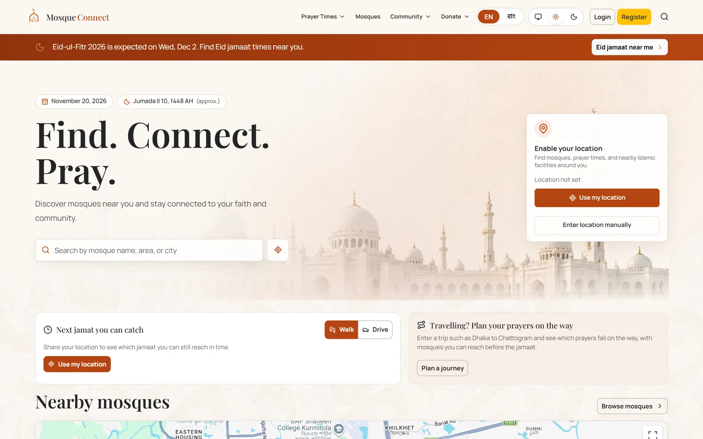

</div>

<br>

## By the numbers

<div align="center">

| 237 | 544 | 2,685 | 28 | 51 |
| :---: | :---: | :---: | :---: | :---: |
| **API endpoints** | **backend tests** | **strings translated into Bangla** | **screens** | **database migrations** |

</div>

MosqueConnect is a full-stack platform built with a React single-page app, a Laravel REST API and MySQL. Worshippers use it to find nearby mosques and their jamaat times. Mosque committees use it to run announcements, events, fundraising and their team. Platform admins use it to keep the whole directory honest. Every push to `main` goes to production automatically.

<br>

## ✨ Highlights

### 🧭 A journey planner that knows when you need to pray

Pick a destination and a departure time. MosqueConnect routes the trip, works out which prayers fall along the way, and ranks the mosques **you can actually reach before the jamaat**. For each one it shows the detour, the wait and the facilities. Live mode then follows the trip as you travel.

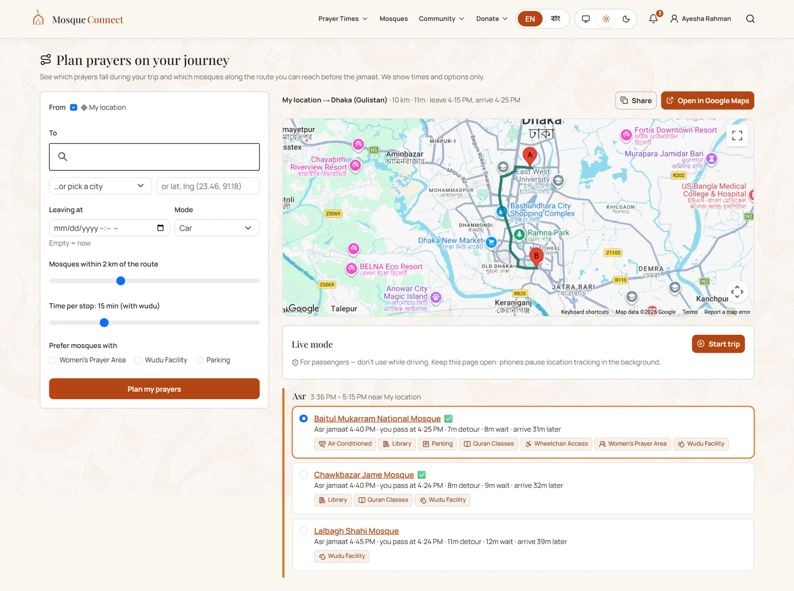

<br>

### 🌙 Eid jamaat near me

During the Eid season a banner appears across the whole site. One tap shows every Eid jamaat nearby on a list and a map, earliest first, with filters for women's arrangements and khutbah language. Any jamaat can be added to Google Calendar or downloaded as a calendar file.

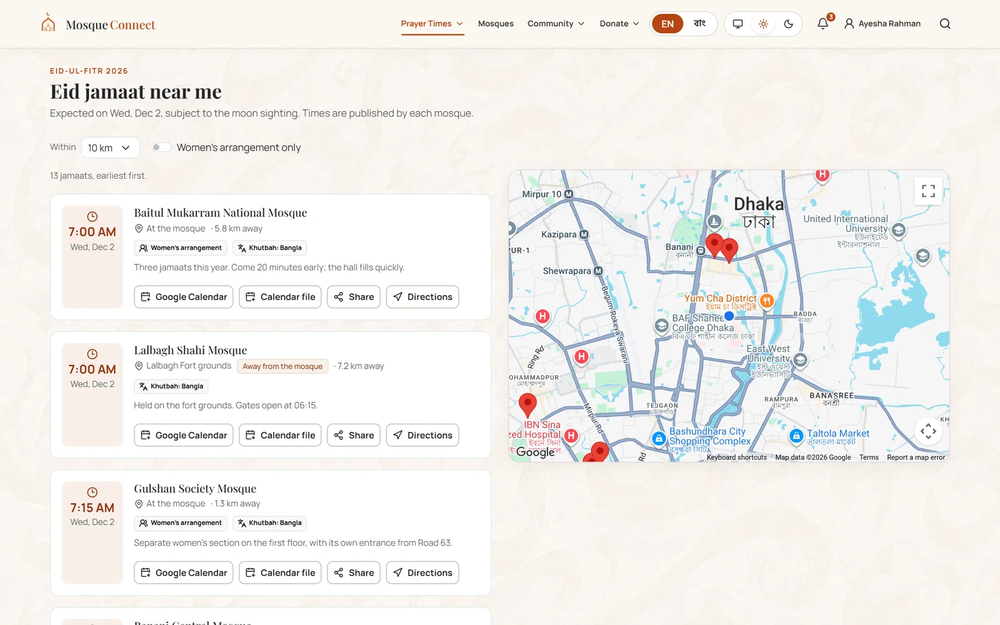

<br>

### 🕌 Mosque profiles with live jamaat times

Each mosque gets its own page: today's five prayers with a countdown to the next jamaat, Jumu'ah sessions, Eid jamaats, announcements by urgency, upcoming events, active campaigns, facilities and a map. If a mosque hasn't published its own times, they are **calculated from its coordinates** and marked as estimated. Visitors can suggest a correction to any time.

<table>
<tr>
<td width="62%">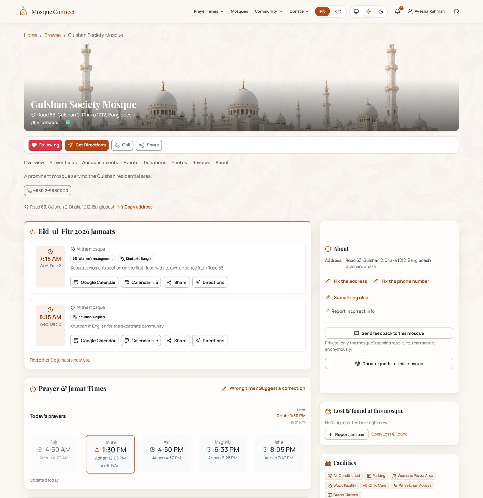</td>
<td width="38%">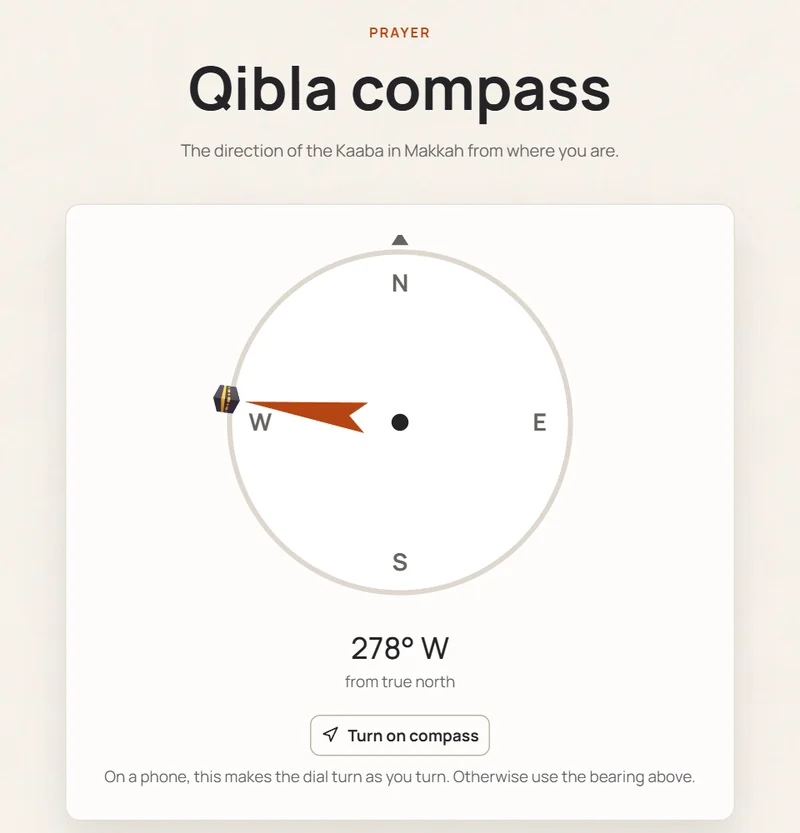<br><sub><b>Qibla compass:</b> shows the bearing from where you are, and the dial turns with your phone.</sub></td>
</tr>
</table>

<br>

### 🔎 Discovery that works the way people search

You can browse by district and area, filter by facilities (women's prayer area, wudu, wheelchair access, parking, Quran classes and more), limit by distance, sort, and switch between list and map. Global search covers both mosques and community content.

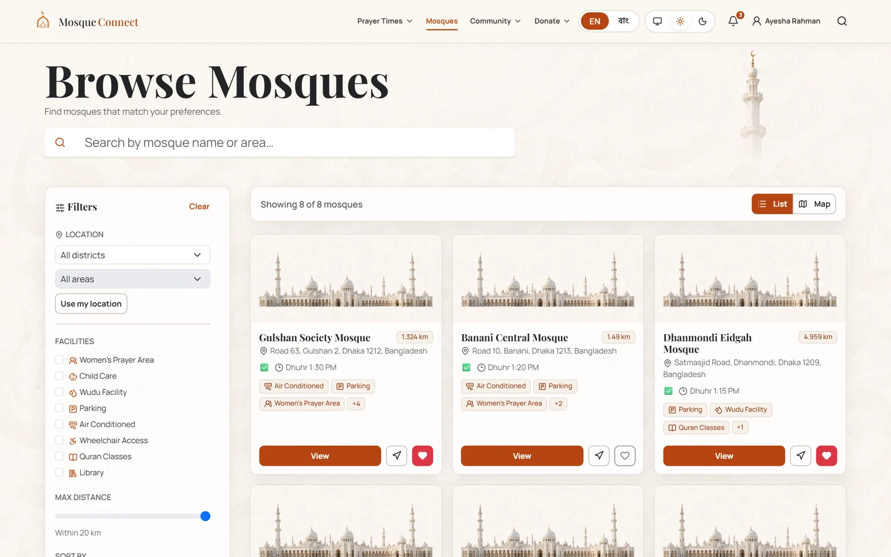

<br>

### 🤝 A community hub, not just a directory

<table>
<tr>
<td width="50%">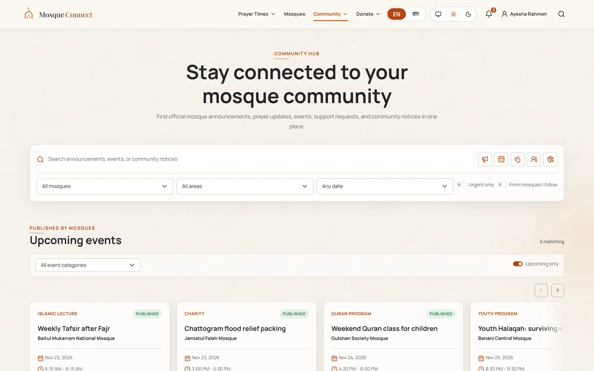</td>
<td width="50%">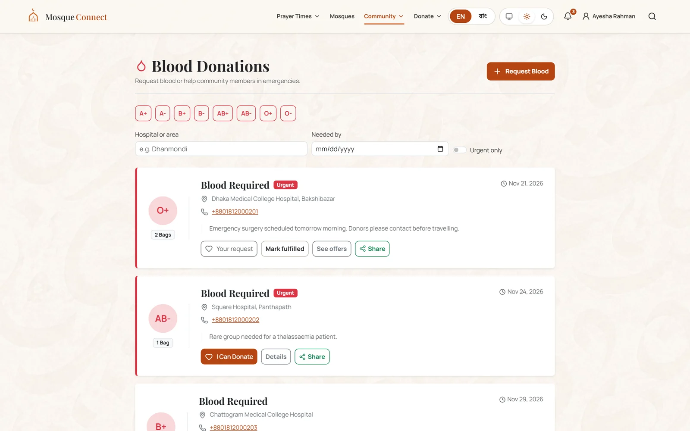</td>
</tr>
<tr>
<td><b>Community hub:</b> announcements, recurring events with registration, volunteering, lost &amp; found and goods donations.</td>
<td><b>Blood donation:</b> urgent requests filtered by blood group, with donor responses, and requesters can mark a request fulfilled.</td>
</tr>
</table>

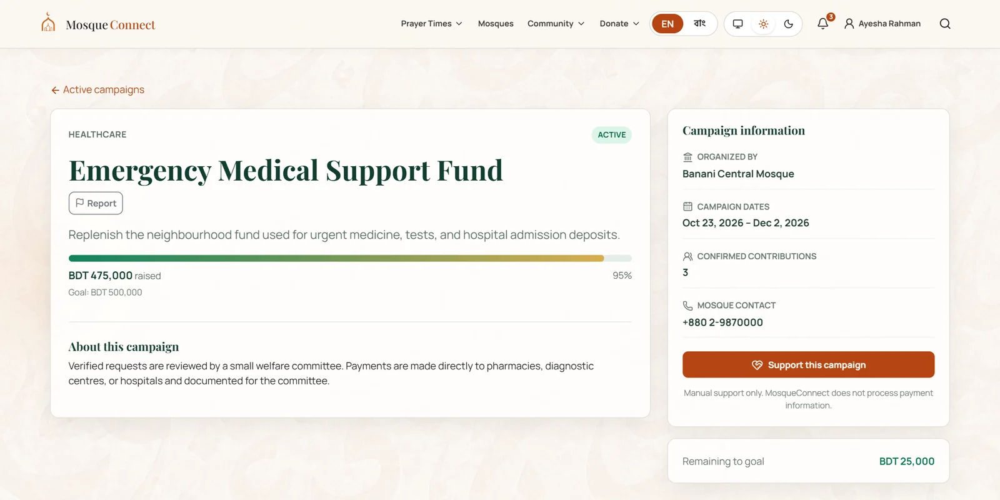

<sub><b>Transparent fundraising:</b> campaigns show their progress and post updates. Contributions are manual pledges that the mosque's admin confirms. No card details ever touch the platform.</sub>

<br>

### 📊 Insights for mosque committees

Mosque admins get a full console: profile, prayer and Jumu'ah schedules, Ramadan timings, Eid jamaats, announcements, events, campaigns, volunteers, a feedback inbox and a team with scoped roles (owner, manager, editor, prayer-times). The **Insights** tab tracks profile views, direction taps, follows and announcement read rates, all counted anonymously and with bots excluded.

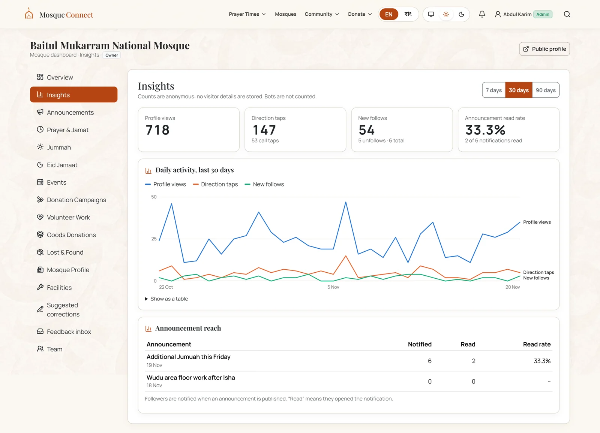

### 🛡️ Platform oversight

Super admins review ownership claims and mosque suggestions, moderate reported content, manage users and mosques, send broadcasts, read contact messages and follow statistics. Every action is written to an audit log.

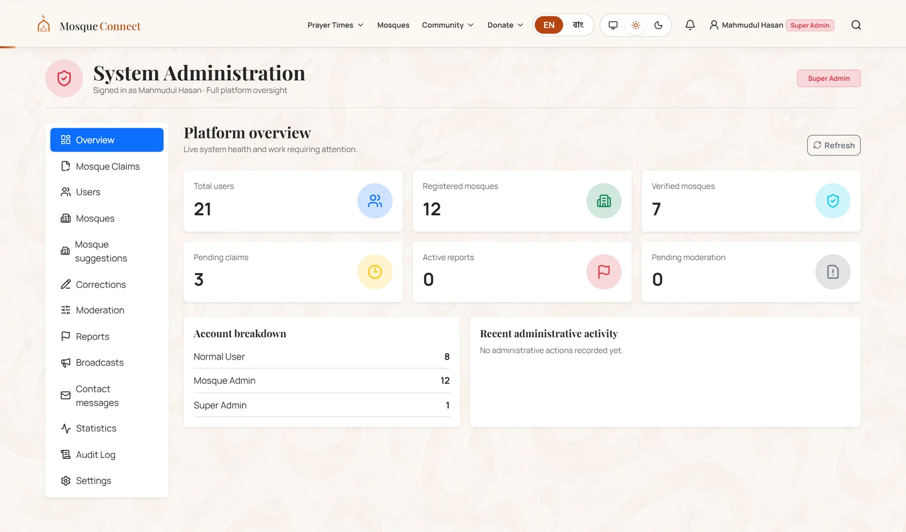

<br>

## 🌗 Light and dark. 🇧🇩 English and Bangla.

The whole interface follows the system theme, or you can switch it yourself. Every one of the 2,685 interface strings is translated into Bangla, including the numerals, dates and times.

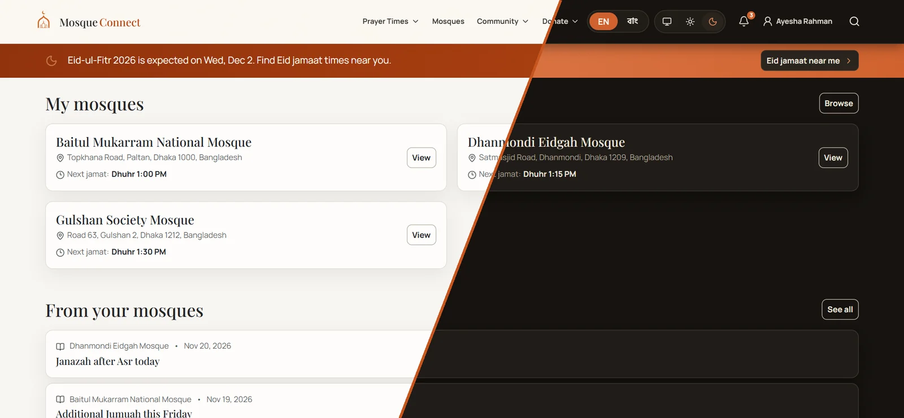

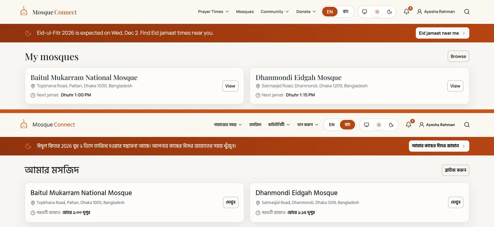

## 📱 Built for the phone in your pocket

<div align="center">
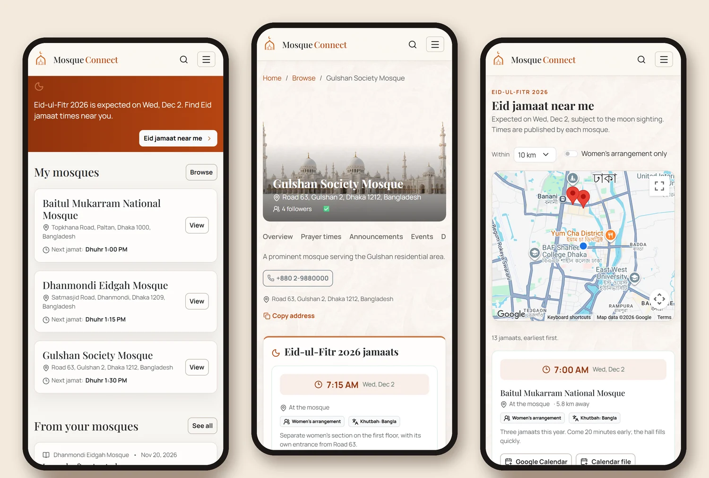
</div>

<br>

## 🏗️ How it fits together

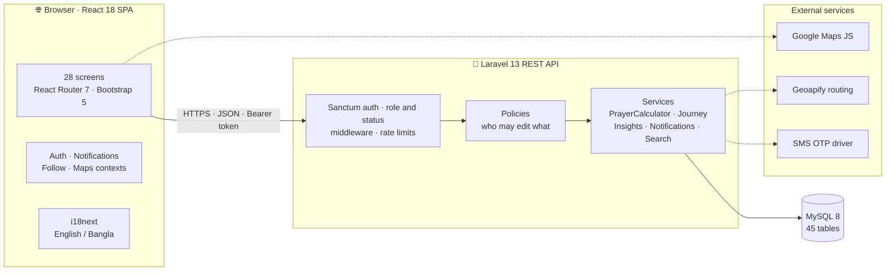
```mermaid
flowchart LR
    subgraph Browser["🌐 Browser · React 18 SPA"]
        UI["28 screens<br/>React Router 7 · Bootstrap 5"]
        CTX["Auth · Notifications<br/>Follow · Maps contexts"]
        I18N["i18next<br/>English / Bangla"]
    end

    subgraph Server["🐘 Laravel 13 REST API"]
        MW["Sanctum auth · role and status<br/>middleware · rate limits"]
        SVC["Services<br/>PrayerCalculator · Journey<br/>Insights · Notifications · Search"]
        POL["Policies<br/>who may edit what"]
    end

    DB[("MySQL 8<br/>45 tables")]

    subgraph Ext["External services"]
        GM["Google Maps JS"]
        GEO["Geoapify routing"]
        SMS["SMS OTP driver"]
    end

    UI -- "HTTPS · JSON · Bearer token" --> MW
    MW --> POL --> SVC --> DB
    UI -.-> GM
    SVC -.-> GEO
    SVC -.-> SMS
```

### What the journey planner does on each request

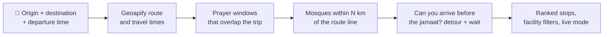
```mermaid
flowchart LR
    A["📍 Origin + destination<br/>+ departure time"] --> B["Geoapify route<br/>and travel times"]
    B --> C["Prayer windows<br/>that overlap the trip"]
    C --> D["Mosques within N km<br/>of the route line"]
    D --> E["Can you arrive before<br/>the jamaat? detour + wait"]
    E --> F["Ranked stops,<br/>facility filters, live mode"]
```

<details>
<summary><b>Detailed architecture, deployment and database figures</b></summary>
<br>

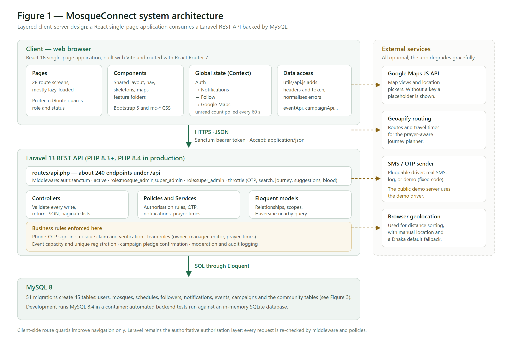

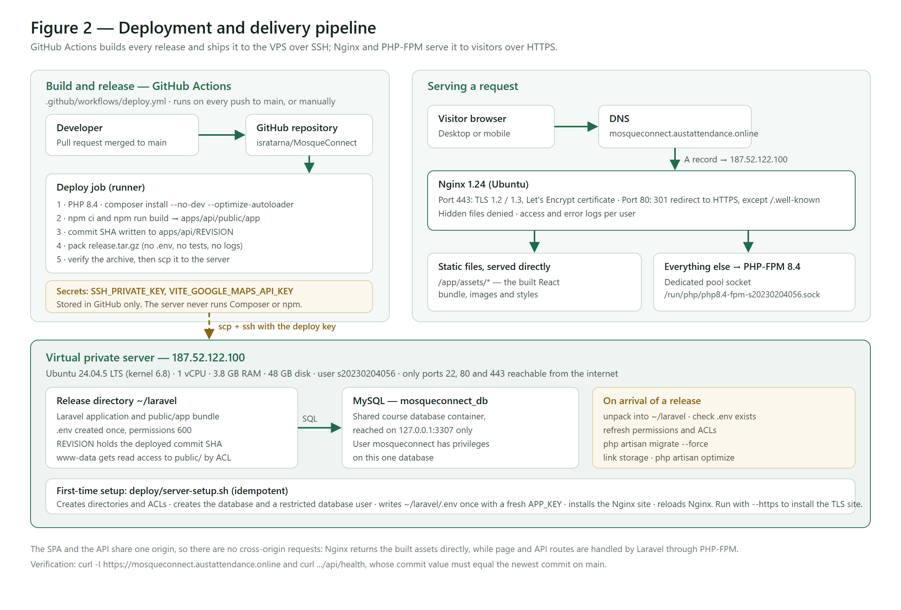

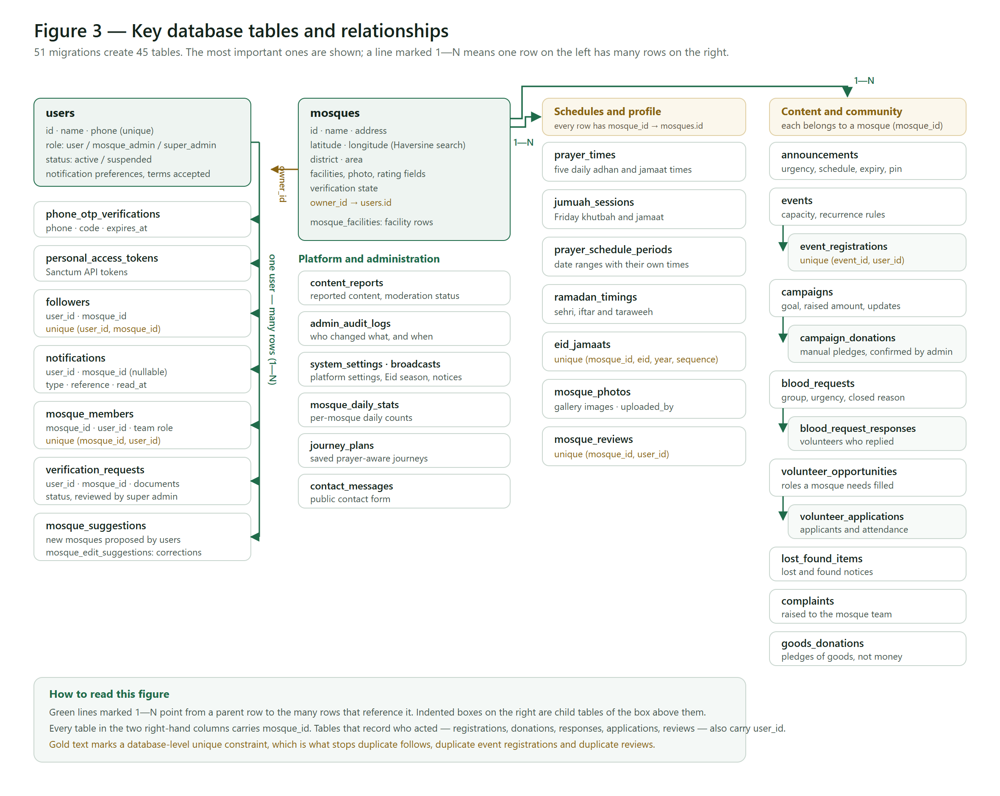

</details>

### Ship it: push to production in one step

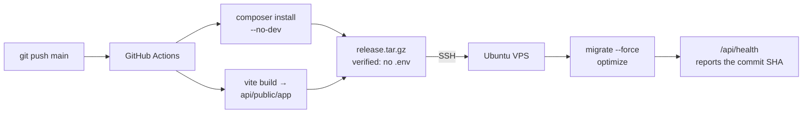
```mermaid
flowchart LR
    P["git push main"] --> CI["GitHub Actions"]
    CI --> C1["composer install<br/>--no-dev"]
    CI --> C2["vite build →<br/>api/public/app"]
    C1 & C2 --> T["release.tar.gz<br/>verified: no .env"]
    T -->|SSH| VPS["Ubuntu VPS"]
    VPS --> M["migrate --force<br/>optimize"]
    M --> H["/api/health<br/>reports the commit SHA"]
```

The server never runs Composer or npm. It unpacks a release that has already been built and checked, so every deployment can be reproduced. `/api/health` returns the deployed commit, so you can check production against `main` at a glance.

<br>

## 🔐 Security by design

- **Phone OTP sign-in** with hashed, expiring, single-use codes and send/verify rate limits. The SMS driver is pluggable.
- **The server is the authority.** Route guards in React only improve navigation. Every request is checked again by Sanctum, account-status middleware and Laravel policies.
- **Scoped mosque teams.** A prayer-times editor can change times and nothing else.
- **Audit log** of administrative actions, plus a content-report and moderation queue.
- **No payments handled.** Campaign support is a manual pledge that the mosque's admin confirms.
- **Privacy-respecting analytics.** Insight counts are anonymous, and bots are excluded.

## ✅ Tested end to end

| Layer | What runs |
| --- | --- |
| Backend | **544 PHPUnit tests** across 57 files, run against in-memory SQLite |
| Frontend logic | **23 Node test suites**: prayer times, Qibla, Eid calendar, route geometry, i18n parity and more |
| Browser | **Playwright** specs in desktop (1440×900) and mobile (390×844) viewports |

<br>

## 🧰 Technology

| Layer | Technology |
| --- | --- |
| Frontend | React 18, Vite 8, React Router 7, Bootstrap 5, Bootstrap Icons, Lucide React, Recharts |
| Localisation | i18next with English and Bangla; light, dark and system themes |
| Maps & routing | Google Maps JavaScript API via `@react-google-maps/api`; browser geolocation with a Dhaka fallback; Geoapify for journey routing |
| Backend | PHP 8.3+ (8.4 in production), Laravel 13, Laravel Sanctum |
| Database | MySQL 8.4 for development and production; SQLite in-memory for backend tests |
| Tooling | npm workspaces, Composer, PHPUnit, Node test runner, Playwright, Docker Compose, GitHub Actions |

<details>
<summary><b>Full feature list</b></summary>
<br>

- Nearby mosque discovery, filters, map display, mosque profiles, facilities, prayer schedules and Jumu'ah sessions
- Prayer times calculated from a mosque's location, marked as estimated when the mosque has not published its own times
- Date-based schedule periods and Ramadan timings
- Eid jamaat publishing, an Eid season banner, and a nearby Eid jamaat page with list and map views
- A prayer-aware journey planner, a Qibla compass, and global search across mosques and community content
- Phone OTP authentication, Sanctum API tokens, profiles, account status checks and role-based authorisation
- Mosque following and notifications with read/unread management and per-user preferences
- Announcements with urgency, scheduling, expiry, pinning and images
- Community events with registration and repeating occurrences, campaign progress with transparency updates, and manual donation pledges
- Blood donation requests and responses, volunteer opportunities and applications, lost and found, goods donation pledges and complaints
- Mosque ownership/verification claims and applicant status tracking
- Mosque administrator tools for profiles, prayer schedules, announcements, events, campaigns, donation confirmation, team members and insights
- Super administrator tools for verification requests, users, mosques, moderation, reports, broadcasts, audit logs, statistics and settings
- Seeded demo data and automated backend, frontend utility and browser tests

Online payment processing is not integrated: campaign contributions are manual pledges that an administrator confirms. Some informational screens use static content.

</details>

<br>

## 🚀 Quick start

The fastest way is Docker:

```sh
cp .env.example .env
docker compose up --build -d
docker compose exec api php artisan migrate --seed
```

Then open **<http://localhost:5173>**. The API health check is at <http://localhost:8000/api/health>.

The seeded **development** database includes demo accounts for each role. They all sign in with the development-only OTP `123456`:

| Role | Phone |
| --- | --- |
| Super admin | `+8801700000001` |
| Mosque admin (verified) | `+8801711000101` |
| Mosque admin (pending) | `+8801711000102` |
| Community member | `+8801812000201` |

These fixtures are seeded only outside production and must never be treated as real credentials.

<details>
<summary><b>Prerequisites and environment files</b></summary>
<br>

Choose Docker or a local installation. Docker needs Docker Desktop with Linux containers and Docker Compose v2.

A local installation needs:

- Node.js 20 or newer and npm (the development container uses Node.js 22)
- PHP 8.3 or newer with Laravel's required extensions, plus PDO MySQL, mbstring, intl, bcmath and zip
- Composer 2
- MySQL 8.x

A Google Maps JavaScript API key is optional. Without it, map areas show a placeholder and the rest of the app still works. A Geoapify key is needed only for the journey planner's routing. Without it, journey planning reports that routing is unavailable and everything else keeps working.

Templates are committed and real environment files are ignored. Never commit credentials.

| File | Purpose | Important variables |
| --- | --- | --- |
| `.env` | Docker Compose ports and MySQL container settings | `COMPOSE_PROJECT_NAME`, `WEB_PORT`, `API_PORT`, `MYSQL_PORT`, `MYSQL_DATABASE`, `MYSQL_USER`, `MYSQL_PASSWORD`, `MYSQL_ROOT_PASSWORD` |
| `apps/web/.env` | Browser application configuration | `VITE_API_URL`, `VITE_GOOGLE_MAPS_API_KEY`, `VITE_DISABLE_GOOGLE_MAPS`, `VITE_CONTACT_EMAIL` |
| `apps/api/.env` | Laravel application configuration | `APP_KEY`, `APP_ENV`, `APP_DEBUG`, `APP_URL`, `FRONTEND_URL`, `DB_*`, `SESSION_*`, `CACHE_STORE`, `QUEUE_CONNECTION`, `MAIL_*`, `OTP_*`, `GEOAPIFY_API_KEY` |
| `deploy/env.production.example` | Template for the server's `~/laravel/.env` | Production values for the variables above |

```sh
cp .env.example .env
cp apps/web/.env.example apps/web/.env
cp apps/api/.env.example apps/api/.env
```

On Windows PowerShell, use `Copy-Item` instead of `cp`. Generate `APP_KEY` with `php artisan key:generate`.

</details>

<details>
<summary><b>Docker details</b></summary>
<br>

The API container creates `apps/api/.env` from its example and generates `APP_KEY` when necessary. Docker Compose passes the container's database settings to Laravel.

```sh
docker compose logs -f
docker compose exec web npm run test --workspace=apps/web
docker compose exec -e APP_ENV=testing -e DB_CONNECTION=sqlite -e DB_DATABASE=:memory: api php artisan test
docker compose down
```

Database data stays in the `mysql_data` Docker volume after `docker compose down`. Running `docker compose down --volumes` deletes that volume as well.

</details>

<details>
<summary><b>Local setup without Docker</b></summary>
<br>

**Database.** Create a database and a development user, choosing your own local password:

```sql
CREATE DATABASE mosqueconnect CHARACTER SET utf8mb4 COLLATE utf8mb4_unicode_ci;
CREATE USER 'mosqueconnect'@'localhost' IDENTIFIED BY 'choose-a-local-password';
GRANT ALL PRIVILEGES ON mosqueconnect.* TO 'mosqueconnect'@'localhost';
FLUSH PRIVILEGES;
```

**API**, from `apps/api`:

```sh
composer install
cp .env.example .env            # then set DB_PASSWORD
php artisan key:generate
php artisan migrate --seed
php artisan serve               # http://localhost:8000
```

**Frontend**, from the repository root:

```sh
npm install
cp apps/web/.env.example apps/web/.env   # VITE_API_URL=http://localhost:8000
npm run dev:web                           # http://localhost:5173
```

**Useful commands**

```sh
# Frontend (repository root)
npm run build:web                         # builds into apps/api/public/app
npm run test --workspace=apps/web
npm run test:e2e --workspace=apps/web     # desktop + mobile viewports; API must be running

# Backend (apps/api)
php artisan migrate:fresh --seed          # rebuild the local database (destructive)
php artisan test                          # SQLite via phpunit.xml
```

Run `composer install` and `npm install` again after pulling changes to `composer.lock` or `package-lock.json`.

</details>

<details>
<summary><b>Production deployment</b></summary>
<br>

The app runs on an Ubuntu VPS. Nginx serves the built assets and passes application requests to PHP-FPM 8.4, and Laravel uses the `mosqueconnect_db` MySQL database.

**Automatic deployment.** Every push to `main` runs [`.github/workflows/deploy.yml`](.github/workflows/deploy.yml), which can also be started by hand. The job:

1. Installs PHP dependencies with `composer install --no-dev --optimize-autoloader`.
2. Builds the React bundle into `apps/api/public/app` and fails if the bundle is missing.
3. Writes the commit SHA into `apps/api/REVISION`, which `/api/health` reports.
4. Packs `release.tar.gz` without `.env`, tests or logs, and checks that the archive holds the vendor autoloader and the built bundle but no `.env`.
5. Copies the archive to the server over SSH using the `SSH_PRIVATE_KEY` secret.
6. Unpacks it into `~/laravel`, refreshes permissions, runs `php artisan migrate --force`, links storage if needed and runs `php artisan optimize`.

Required repository secrets: `SSH_PRIVATE_KEY`, and optionally `VITE_GOOGLE_MAPS_API_KEY`.

**First-time server setup**

1. Install the stack: `sudo apt update && sudo apt install -y nginx php8.4-fpm php8.4-mysql php8.4-mbstring php8.4-xml php8.4-curl php8.4-bcmath php8.4-intl php8.4-gd php8.4-zip acl unzip git`.
2. Copy the deployment folder: `scp -r deploy USER@HOST:~/deploy`.
3. Run `bash ~/deploy/server-setup.sh`. It prepares directories and ACLs, creates `mosqueconnect_db` with a database user limited to that database, writes `~/laravel/.env` once with a fresh `APP_KEY`, and installs the Nginx site. Running it again is safe and never overwrites an existing `.env`.
4. Edit `~/laravel/.env`: confirm `APP_ENV=production` and `APP_DEBUG=false`, set `APP_URL`, `FRONTEND_URL` and the `DB_*` values. Before any public use, set a real `OTP_SMS_DRIVER` with `OTP_ALLOW_LOG_DRIVER=false`. Keep the file at `chmod 600`.
5. Create a deploy key pair, append the public half to `~/.ssh/authorized_keys`, and store the private half as the `SSH_PRIVATE_KEY` secret.
6. Point DNS at the server. For HTTPS, place the certificate and key at `~/ssl/live/<domain>/fullchain.pem` and `privkey.pem`, then run `bash ~/deploy/server-setup.sh --https`.
7. Optionally seed demo data once: `cd ~/laravel && php artisan db:seed --force`.

**Verifying a deployment**

```sh
curl -I https://mosqueconnect.austattendance.online
curl https://mosqueconnect.austattendance.online/api/health
```

The `commit` in the health response must match the latest commit on `main`. If something fails, check `/var/log/nginx/s20230204056-error.log` and `~/laravel/storage/logs/laravel.log` on the server.

> **Security note.** Never run a public deployment with `APP_ENV=local` or with the log OTP driver. OTP codes written to the log would let anyone with log access sign in as any phone number. Never commit `.env` files, SSH keys or certificates.

More detail: [`deploy/README.md`](deploy/README.md) · [`DEPLOYMENT.md`](DEPLOYMENT.md) · [`docs/docker.md`](docs/docker.md) · [`docs/i18n.md`](docs/i18n.md)

</details>

<details>
<summary><b>Project structure</b></summary>
<br>

```text
MosqueConnect/
├── apps/
│   ├── web/                 # React/Vite SPA
│   │   ├── public/          # Static images
│   │   ├── e2e/             # Playwright browser tests
│   │   └── src/             # Pages, components, contexts, hooks, utils, i18n, tests
│   └── api/                 # Laravel REST API
│       ├── app/             # Controllers, models, policies, services, middleware
│       ├── database/        # Migrations, factories and seeders
│       ├── routes/api.php   # Public and authenticated API routes
│       └── tests/           # PHPUnit feature and unit tests
├── docker/                  # Container definitions for development and release images
├── deploy/                  # VPS Nginx configs, server-setup.sh, production env template
├── docs/                    # Figures, screenshots, Docker and i18n guides
├── .github/workflows/       # deploy.yml: build and deploy to the VPS
├── compose.yaml             # Web, API and MySQL services
└── package.json             # npm workspace commands
```

</details>

<details>
<summary><b>Repository hygiene</b></summary>
<br>

The root `.gitignore` covers environment files, SSH and deploy keys, `node_modules`, Composer `vendor`, Vite/Laravel build output, caches, logs and runtime storage. The nested ignore files under Laravel's `bootstrap/cache` and `storage` are intentional: they keep the writable directory tree in a fresh clone while ignoring generated contents.

Before committing, check that no secret or generated dependency is tracked:

```sh
git status --short
git ls-files | grep -E '(^|/)(\.env$|node_modules/|vendor/)'
```

Only `.env.example` templates should appear.

</details>

<br>

<div align="center">
<sub>CSE 3100 project · Ahsanullah University of Science and Technology · Dhaka, Bangladesh</sub>
</div>
